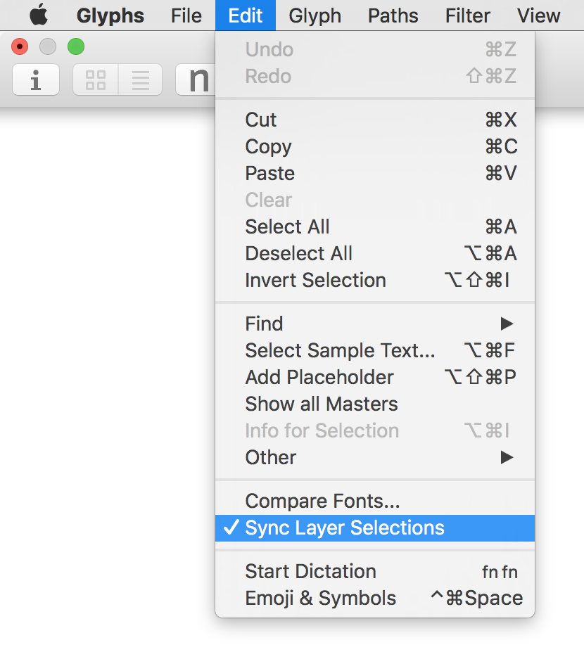

# SyncSelection.glyphsFilter

This is a plugin for the [Glyphs font editor](http://glyphsapp.com/) by Georg Seifert.

It will keep your selection in sync between multiple layers of the same glyph. I.e., if you select the first path of the Regular layer, the first paths of Bold and Light are also selected. Works for path nodes, anchors and components.

After installation, you can toggle syncing via *Edit > Sync Layer Selections* (**de:** Auswahl zwischen Ebenen synchronisieren, **es:** Sincronizar selección entre capas, **fr:** Synchroniser la sélection entre les couches).

The plug-in assumes compatibility between layers, and will sync selections as far as possible. It always cancels existing selections on other layers.

### Installation

1. Go to *Window > Plugin Manager.*
2. Click on the *Install* button next to *SyncSelection.*
3. Restart the app.

### Usage Instructions

1. Turn on selection syncing via *Edit > Sync Layer Selections.*
2. Select something and switch to other layers

### Requirements

The plugin has only been tested for Glyphs 2.4.x on macOS Sierra. It may not work on older configurations.

### License

Copyright 2017 Rainer Erich Scheichelbauer (@mekkablue).
Based on sample code by Georg Seifert (@schriftgestalt) and Jan Gerner (@yanone).

Licensed under the Apache License, Version 2.0 (the "License");
you may not use this file except in compliance with the License.
You may obtain a copy of the License at

http://www.apache.org/licenses/LICENSE-2.0

See the License file included in this repository for further details.
